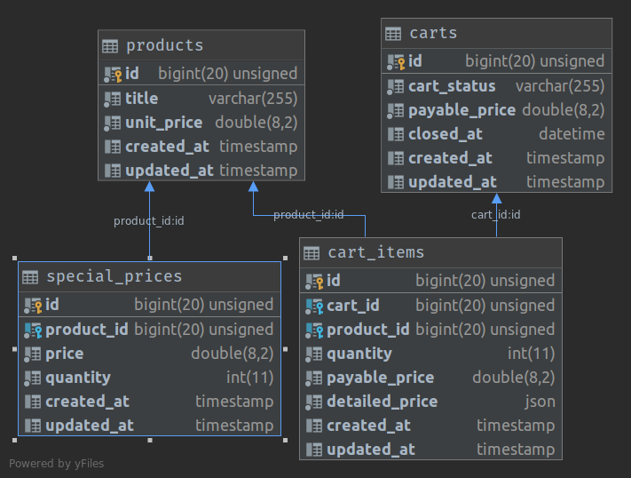

# Devolon Challenge (Cart Service)

My demo for interview with Devolon. This app contains a dockerized web app which designed to easily install and configured on any machine.

## Installation Requirements
* Shell Access
* Docker
* Docker Compose
* Git
* Make
* CURL

## Docker Services
* NGINX Reverse Proxy
* PHP FPM
* MySQL Database

## Installation Guide:
```
cd ~
git clone git@github.com:zeina1i/devolon-challenge.git
cd devolon-challenge
cp .env.example .env
make setup
```

Now app should be alive on [http://localhost:8090](http://localhost:8090)
<p align="center"></p>

## DataModel
<p align="center"></p>

## Routes
<p align="center"></p>

## How To Use App:
Issue these sets of command inside your terminal:
<br />
Create an empty cart:
```
curl --location --request POST 'http://localhost:8090/api/v1/cart/create/' \
--header 'Content-Type: application/json' \
--data-raw ''
```

Add item to cart:
```
curl --location --request POST 'http://localhost:8090/api/v1/cart/add-item' \
--header 'Content-Type: application/json' \
--data-raw '{
    "product_id": 1,
    "cart_id": 1
}'
```

Change quantity of existing item in cart:
```
curl --location --request POST 'http://localhost:8090/api/v1/cart/change-quantity' \
--header 'Content-Type: text/plain' \
--data-raw '{
    "product_id": 1,
    "cart_id": 1,
    "quantity": 4
}'
```

Remove item from cart:
```
curl --location --request DELETE 'http://localhost:8090/api/v1/cart/remove-item' \
--header 'Content-Type: text/plain' \
--data-raw '{
    "product_id": 1,
    "cart_id": 1
}'
```
## Commands
In order to run commands easily you can use make command. This will help you to easily interact with containers or app.
<p align="center"></p>

## Run Tests
```
make phpunit
```