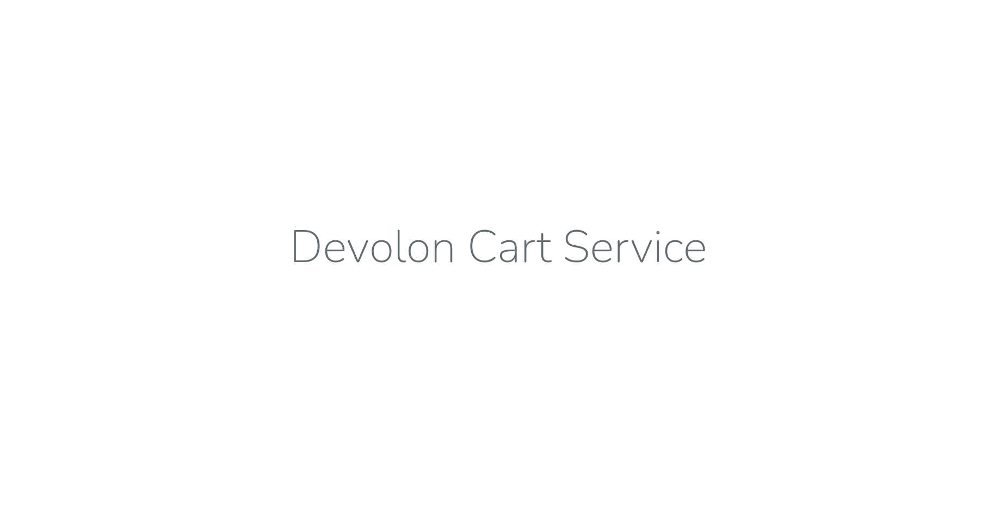
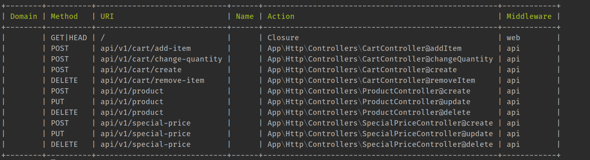
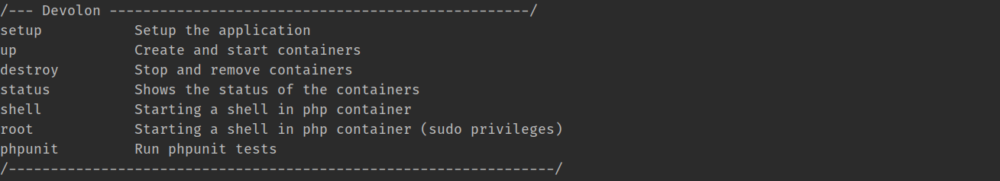

# Devolon Challenge (Cart Service)

My demo for interview with Devolon. This app contains a dockerized web app which designed to easily install and configured on any machine.

## Installation Requirements
* Shell Access
* Docker
* Docker Compose
* Git
* Make
* CURL

## Docker Services
* NGINX Reverse Proxy
* PHP FPM
* MySQL Database

## Installation Guide:
```
cd ~
git clone git@github.com:zeina1i/devolon-challenge.git
cd devolon-challenge
cp .env.example .env
make setup
```

Now app should be alive on [http://localhost:8009](http://localhost:8009)
<p align="center"></p>

## Routes
<p align="center"></p>

## Commands
<p align="center"></p>

## Run Tests
```
make phpunit
```